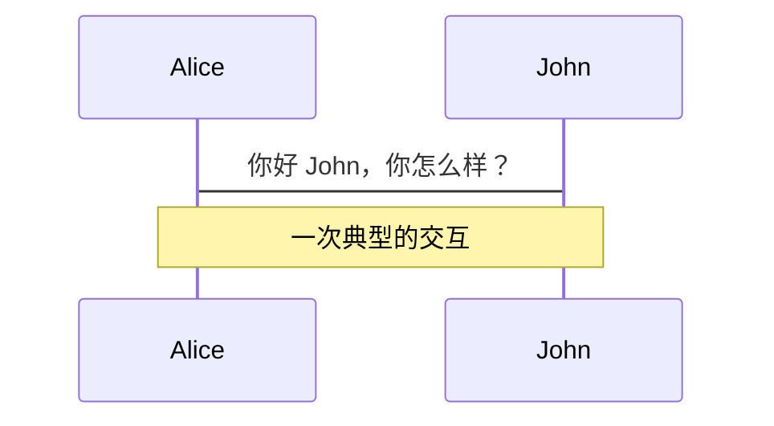
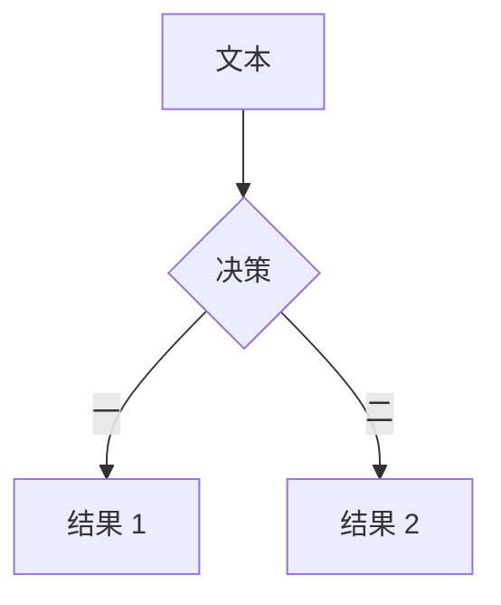
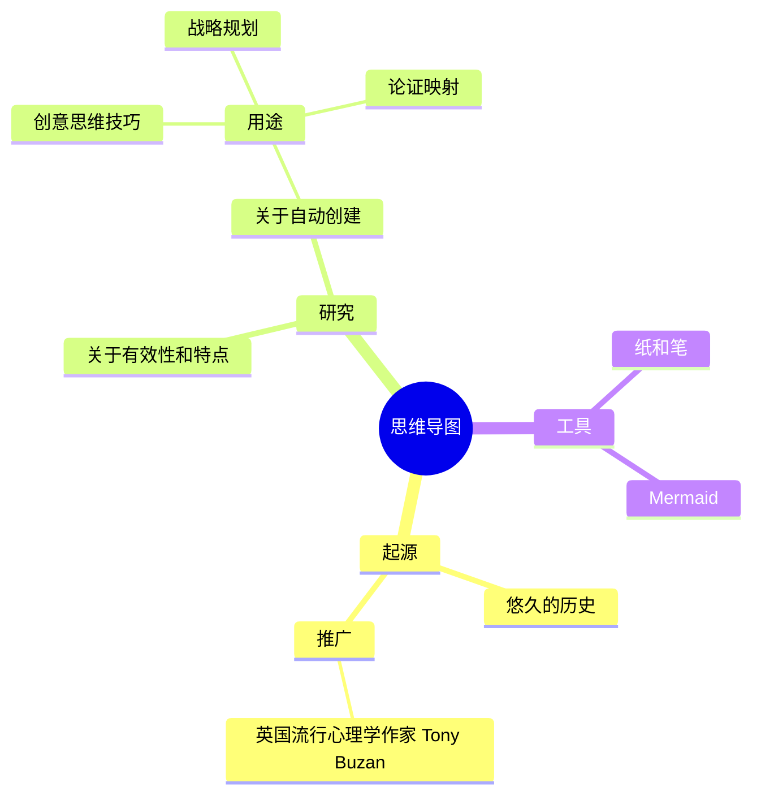
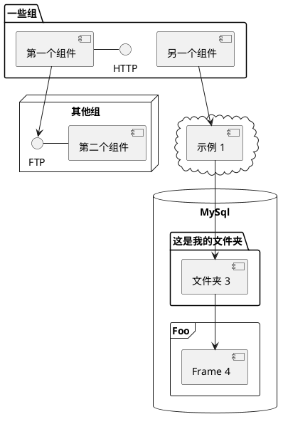

---
# You can also start simply with 'default'
theme: seriph
# random image from a curated Unsplash collection by Anthony
# like them? see https://unsplash.com/collections/94734566/slidev
background: https://cover.sli.dev
# some information about your slides (markdown enabled)
title: 欢迎来到 Slidev
info: |
  ## Slidev 入门模板
  AI 时代的幻灯片工具

  了解更多请访问 [Sli.dev](https://sli.dev)
# apply unocss classes to the current slide
class: text-center
# https://sli.dev/features/drawing
drawings:
  persist: false
# slide transition: https://sli.dev/guide/animations.html#slide-transitions
transition: slide-left
# enable MDC Syntax: https://sli.dev/features/mdc
mdc: true
# open graph
seoMeta:
  # By default, Slidev will use ./og-image.png if it exists,
  # or generate one from the first slide if not found.
  ogImage: auto
  # ogImage: https://cover.sli.dev
---

# 欢迎来到 Slidev

<h2>✨ AI 时代的幻灯片工具</h2>

<div @click="$slidev.nav.next" class="mt-12 py-1" hover:bg="white op-10">
  按空格键进入下一页 <carbon:arrow-right />
</div>

<div class="abs-br m-6 text-xl">
  <button @click="$slidev.nav.openInEditor()" title="在编辑器中打开" class="slidev-icon-btn">
    <carbon:edit />
  </button>
  <a href="https://github.com/slidevjs/slidev" target="_blank" class="slidev-icon-btn">
    <carbon:logo-github />
  </a>
</div>

<!--
The last comment block of each slide will be treated as slide notes. It will be visible and editable in Presenter Mode along with the slide. [Read more in the docs](https://sli.dev/guide/syntax.html#notes)
-->

---
transition: fade-out
---

# 什么是 Slidev？

Slidev 是一个专为开发者设计的幻灯片制作和演示工具。

它基于 Markdown，让你可以专注于内容创作而不是样式设计。
基于 Markdown 意味着，AI文本大模型可以轻松的生成幻灯片。

---

## 核心特性

- 📝 **文本驱动** - 使用 Markdown 专注于内容
- 🎨 **主题系统** - 可共享和重用的主题包
- 🧑‍💻 **开发者友好** - 代码高亮和实时编码
- 🤹 **交互性强** - 可嵌入 Vue 组件
- 🎥 **录制功能** - 内置录制和摄像头视图
- 📤 **多种导出** - 支持 PDF、PPTX、PNG 等格式
- 🛠 **高度可定制** - 网页能实现的功能基本都支持
- ✨ **AI 友好** - 轻松生成 AI 幻灯片

---

### 在幻灯片中直接演示代码

```ts
console.log('Hello, Slidev!')
```

---

### 代码高亮示例

使用不同的语言和主题：

```js
def hello_slidev():
    print("Hello from Slidev!")
    
hello_slidev()
```

---

### 多种导出格式支持

Slidev 支持将你的演示文稿导出为多种格式：

- **PDF** - 适合打印和分享
- **PPTX** - 与 Microsoft PowerPoint 兼容
- **PNG** - 导出为图像序列
- **SPA** - 导出为可托管的单页应用程序

<br>

了解更多 [为什么选择 Slidev?](https://sli.dev/guide/why)

<!--
You can have `style` tag in markdown to override the style for the current page.
Learn more: https://sli.dev/features/slide-scope-style
-->

<style>
h1 {
  background-color: #2B90B6;
  background-image: linear-gradient(45deg, #4EC5D4 10%, #146b8c 20%);
  background-size: 100%;
  -webkit-background-clip: text;
  -moz-background-clip: text;
  -webkit-text-fill-color: transparent;
  -moz-text-fill-color: transparent;
}
</style>

<!--
Here is another comment.
-->

---
transition: slide-up
level: 2
---

# 导航

将鼠标悬停在左下角可以看到导航控制面板，[了解更多](https://sli.dev/guide/ui#navigation-bar)

## 键盘快捷键

|                                                     |                             |
| --------------------------------------------------- | --------------------------- |
| <kbd>右方向键</kbd> / <kbd>空格</kbd>                 | 下一个动画或幻灯片           |
| <kbd>左方向键</kbd>  / <kbd>Shift</kbd><kbd>空格</kbd> | 上一个动画或幻灯片           |
| <kbd>上方向键</kbd>                                   | 上一张幻灯片                |
| <kbd>下方向键</kbd>                                   | 下一张幻灯片                |

<!-- https://sli.dev/guide/animations.html#click-animation -->

<p v-after class="absolute bottom-23 left-45 opacity-30 transform -rotate-10">这里!</p>

---
layout: two-cols
layoutClass: gap-16
---

# 目录

你可以使用 `Toc` 组件为幻灯片生成目录：

```html
<Toc minDepth="1" maxDepth="1" />
```

标题将从幻灯片内容中推断出来，你也可以在 frontmatter 中使用 `title` 和 `level` 来覆盖它。

::right::

<Toc text-sm minDepth="1" maxDepth="2" />

---
layout: image-right
image: https://cover.sli.dev
---

# 代码

使用代码片段并直接获得高亮显示，甚至支持类型悬停！

```ts [filename-example.ts] {all|4|6|6-7|9|all} twoslash
// TwoSlash 启用 TypeScript 悬停信息
// 和在代码块中显示错误
// 更多信息请访问 https://shiki.style/packages/twoslash
import { computed, ref } from 'vue'

const count = ref(0)
const doubled = computed(() => count.value * 2)

doubled.value = 2
```

<arrow v-click="[4, 5]" x1="350" y1="310" x2="195" y2="342" color="#953" width="2" arrowSize="1" />

<!-- 这允许你嵌入外部代码块 -->
<<< @/snippets/external.ts#snippet

<!-- 页脚 -->

[了解更多](https://sli.dev/features/line-highlighting)

<!-- 内联样式 -->
<style>
.footnotes-sep {
  @apply mt-5 opacity-10;
}
.footnotes {
  @apply text-sm opacity-75;
}
.footnote-backref {
  display: none;
}
</style>

<!--
备注也可以与点击同步

[click] 第一次点击后会高亮显示

[click] 使用 `count = ref(0)` 高亮显示

[click:3] 最后一次点击（跳过两次点击）
-->

---
level: 2
---

# Shiki 魔法移动

由 [shiki-magic-move](https://shiki-magic-move.netlify.app/) 提供支持，Slidev 支持跨多个代码片段的动画。

添加多个代码块并用 <code>````md magic-move</code> (四个反引号) 包裹它们以启用魔法移动。例如：

````md magic-move {lines: true}
```ts {*|2|*}
// 步骤 1
const author = reactive({
  name: 'John Doe',
  books: [
    'Vue 2 - Advanced Guide',
    'Vue 3 - Basic Guide',
    'Vue 4 - The Mystery'
  ]
})
```

```ts {*|1-2|3-4|3-4,8}
// 步骤 2
export default {
  data() {
    return {
      author: {
        name: 'John Doe',
        books: [
          'Vue 2 - Advanced Guide',
          'Vue 3 - Basic Guide',
          'Vue 4 - The Mystery'
        ]
      }
    }
  }
}
```

```ts
// 步骤 3
export default {
  data: () => ({
    author: {
      name: 'John Doe',
      books: [
        'Vue 2 - Advanced Guide',
        'Vue 3 - Basic Guide',
        'Vue 4 - The Mystery'
      ]
    }
  })
}
```

非代码块将被忽略。

```vue
<!-- 步骤 4 -->
<script setup>
const author = {
  name: 'John Doe',
  books: [
    'Vue 2 - Advanced Guide',
    'Vue 3 - Basic Guide',
    'Vue 4 - The Mystery'
  ]
}
</script>
```
````

---

# 组件

<div grid="~ cols-2 gap-4">
<div>

你可以直接在幻灯片中使用 Vue 组件。

我们提供了一些内置组件，如 `<Tweet/>` 和 `<Youtube/>`，你可以直接使用。添加自定义组件也非常简单。

```html
<Counter :count="10" />
```

<!-- ./components/Counter.vue -->
<Counter :count="10" m="t-4" />

查看 [指南](https://sli.dev/builtin/components.html) 了解更多。

</div>
<div>

```html
<Tweet id="1390115482657726468" />
```

<Tweet id="1390115482657726468" scale="0.65" />

</div>
</div>

<!--
带有 **粗体**、*斜体* 和 ~~删除线~~ 文字的演示者备注。

同样，HTML 元素也是有效的：
<div class="flex w-full">
  <span style="flex-grow: 1;">左侧内容</span>
  <span>右侧内容</span>
</div>
-->

---
class: px-20
---

# 主题

Slidev 拥有强大的主题支持。主题可以提供样式、布局、组件，甚至工具配置。只需在 frontmatter 中进行**一次编辑**即可切换主题：

<div grid="~ cols-2 gap-2" m="t-2">

```yaml
---
theme: default
---
```

```yaml
---
theme: seriph
---
```


</div>

了解更多关于 [如何使用主题](https://sli.dev/guide/theme-addon#use-theme) 并
查看 [精彩主题画廊](https://sli.dev/resources/theme-gallery)。

---

# 点击动画

你可以向元素添加 `v-click` 来添加点击动画。

点击幻灯片时显示：

```
<v-click>点击幻灯片时显示。</v-click>
```

<br>

<v-click>

[了解更多](https://sli.dev/guide/animations#click-animation)

</v-click>

---

# 动画

运动动画由 [@vueuse/motion](https://motion.vueuse.org/) 提供支持，通过 `v-motion` 指令触发。

```html
<div
  v-motion
  :initial="{ x: -80 }"
  :enter="{ x: 0 }"
  :click-3="{ x: 80 }"
  :leave="{ x: 1000 }"
>
  Slidev
</div>
```

<div class="w-60 relative">
  <div class="relative w-40 h-40">
    
    
    
  </div>

  <div
    class="text-5xl absolute top-14 left-40 text-[#2B90B6] -z-1"
    v-motion
    :initial="{ x: -80, opacity: 0}"
    :enter="{ x: 0, opacity: 1, transition: { delay: 2000, duration: 1000 } }">
    Slidev
  </div>
</div>

<!-- vue script setup 脚本可以直接在代码中使用，并且只影响当前页面 -->
<script setup lang="ts">
const final = {
  x: 0,
  y: 0,
  rotate: 0,
  scale: 1,
  transition: {
    type: 'spring',
    damping: 10,
    stiffness: 20,
    mass: 2
  }
}
</script>

<div
  v-motion
  :initial="{ x:35, y: 30, opacity: 0}"
  :enter="{ y: 0, opacity: 1, transition: { delay: 3500 } }">

[了解更多](https://sli.dev/guide/animations.html#motion)

</div>

---

# LaTeX

LaTeX 开箱即用。由 [KaTeX](https://katex.org/) 提供支持。

<div h-3 />

行内 $\sqrt{3x-1}+(1+x)^2$

块级
$$ {1|3|all}
\begin{aligned}
\nabla \cdot \vec{E} &= \frac{\rho}{\varepsilon_0} \\
\nabla \cdot \vec{B} &= 0 \\
\nabla \times \vec{E} &= -\frac{\partial\vec{B}}{\partial t} \\
\nabla \times \vec{B} &= \mu_0\vec{J} + \mu_0\varepsilon_0\frac{\partial\vec{E}}{\partial t}
\end{aligned}
$$

[了解更多](https://sli.dev/features/latex)

---

# 图表

你可以直接在 Markdown 中从文本描述创建图表/图形。

<div class="grid grid-cols-4 gap-5 pt-4 -mb-6">









</div>

了解更多：[Mermaid 图表](https://sli.dev/features/mermaid) 和 [PlantUML 图表](https://sli.dev/features/plantuml)

---
foo: bar
dragPos:
  square: 691,32,167,_,-16
---

# 可拖拽元素

双击可拖拽元素以编辑它们的位置。

<br>

###### 指令用法

```

```

<br>

###### 组件用法

```
<v-drag text-3xl>
  <div class="i-carbon:arrow-up" />
  使用 `v-drag` 组件来获得可拖拽容器！
</v-drag>
```

<v-drag pos="305,328,261,_,-15">
  <div text-center text-3xl border border-main rounded>
    双击我！
  </div>
</v-drag>


###### 可拖拽箭头

```
<v-drag-arrow two-way />
```

<v-drag-arrow pos="378,209,31,109" two-way op70 />

---
src: ./pages/imported-slides.md
hide: false
---

---

# Monaco 编辑器

Slidev 提供内置的 Monaco Editor 支持。

向代码块添加 `{monaco}` 将其转换为编辑器：

```ts {monaco}
import { ref } from 'vue'
import { emptyArray } from './external'

const arr = ref(emptyArray(10))
```

使用 `{monaco-run}` 创建一个可以直接在幻灯片中执行代码的编辑器：

```ts {monaco-run}
import { version } from 'vue'
import { emptyArray, sayHello } from './external'

sayHello()
console.log(`vue ${version}`)
console.log(emptyArray<number>(10).reduce(fib => [...fib, fib.at(-1)! + fib.at(-2)!], [1, 1]))
```

---

# 第三方库集成

Slidev 支持集成各种第三方库，包括 Three.js、ECharts 等流行库。

---

## Three.js演示

下面是一个使用 Three.js 创建的立方体演示：

<ThreeDemo />

---

## 数据可视化演示

下面是一个使用 ECharts 创建的数据可视化图表：

<chart-demo />

---

通过 Vue 组件，你可以轻松地将各种第三方库集成到你的幻灯片中，为观众带来丰富的视觉体验和数据展示。

---

# 了解更多

[文档](https://sli.dev) · [GitHub](https://github.com/slidevjs/slidev) · [案例展示](https://sli.dev/resources/showcases)

<PoweredBySlidev mt-10 />
